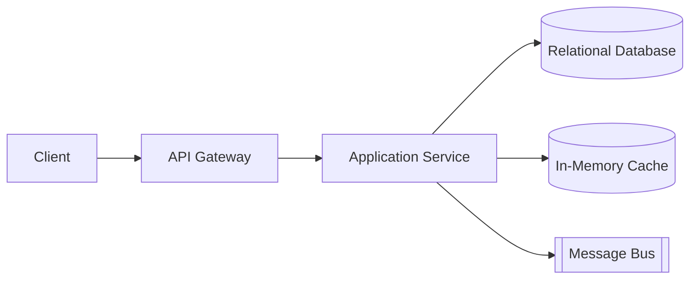
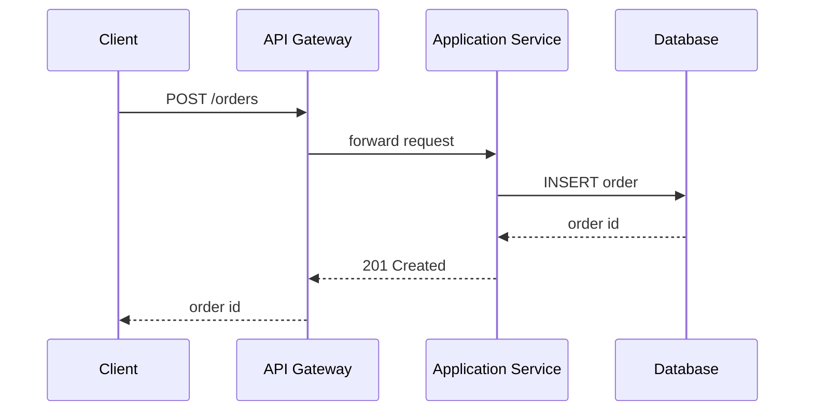
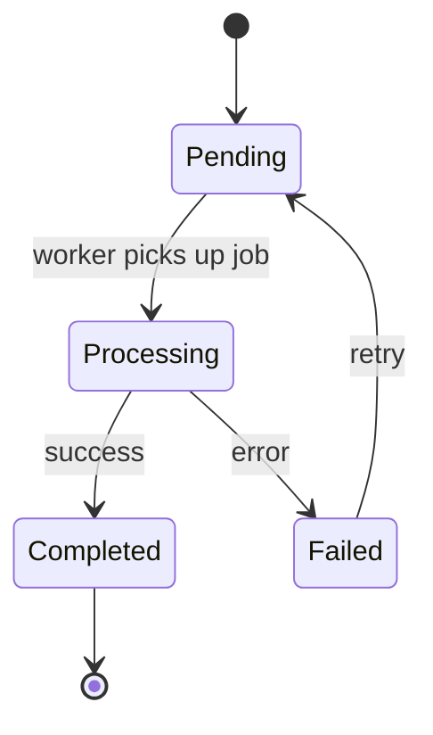
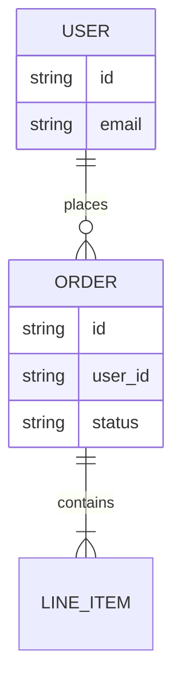

# Mermaid diagram examples, by TDD use case

One minimal, valid snippet per diagram type from the Diagram Selection Matrix (`SKILL.md` step 6).
Use these as syntax scaffolding, not literal content -- swap in the design's actual
components/actors/states/entities.

## System Architecture / Component Breakdown -- `flowchart`

## Data Flow / Request Lifecycles -- `sequenceDiagram`

## State Transitions / Job Lifecycles -- `stateDiagram-v2`

## Data Models / Entity Relationships -- `erDiagram`

**Node/label conventions**: use descriptive identifiers (`Gateway`, not `A`), keep edge labels
short (a verb phrase, e.g. `validates`, `publishes to`), and prefer one diagram per concern over a
single mega-diagram that tries to show architecture, data flow, and state all at once.
